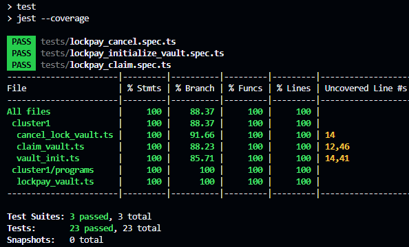
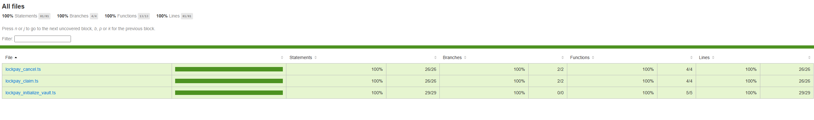

# 🔐 LockPay Vault

A deterministic escrow vault built with Anchor on Solana.

LockPay Vault allows:

- A sender to lock SOL for a receiver
- The receiver to claim the funds
- The sender to cancel if the funds are not claimed

This vault enforces a strict mutual exclusivity constraint:

Funds can only be claimed OR canceled — never both.

---

# 🚀 Overview

LockPay Vault is a minimal but secure escrow implementation designed to demonstrate:

- PDA-based custody
- Deterministic account derivation
- State-driven constraints
- Authorization enforcement
- Safe fund transfers
- Devnet deployment

Built using:

- Anchor Framework
- Solana Devnet
- TypeScript Test Suite

---

# 🧠 Unique Constraint Logic

Core invariant of the system:

claimed == false:
    - Receiver may claim
    - Sender may cancel

claimed == true:
    - Claim blocked
    - Cancel blocked

This guarantees:

- No double withdrawal
- No race condition exploitation
- Deterministic terminal state
- Secure escrow behavior

---

# 🏗 Architecture

## Accounts

### Vault (PDA)

Stores escrow state.

Fields:
- sender: Pubkey
- receiver: Pubkey
- amount: u64
- claimed: bool
- bump: u8

Seeds:
["vault", sender, receiver]

### Vault Authority (PDA)

Controls escrowed lamports.

Seeds:
["vault_authority"]

Used to securely hold funds during escrow.

## Program layout

The Anchor program is organized in a modular layout:

- `constants.rs` (PDA seeds, account sizing, minimum init amount)
- `errors.rs` (Anchor `LockPayError`)
- `state/` (account structs)
- `contexts/` (account validation / constraints)
- `instructions/` (handlers)
- `utils/` (shared helpers)

---

# 📜 Instructions

## initialize_vault

- Sender locks SOL
- Vault state initialized
- claimed = false

## claim

- Only receiver can call
- Transfers SOL to receiver
- Sets claimed = true

## cancel

- Only sender can call
- Transfers SOL back to sender
- Closes vault account

---

# 🧪 Test Coverage

The test suite validates:

- Successful initialization
- Successful claim
- Successful cancel
- Prevention of double claim
- Prevention of cancel after claim
- Unauthorized access rejection
- PDA derivation integrity
- Balance consistency

Tests are split into two categories:

- Offline client tests (Jest) that validate transaction / instruction construction
- Integration tests (Anchor + ts-mocha) that execute instructions against a cluster

📸 Screenshot of passing tests:

Open the HTML coverage report:

- `coverage/lcov-report/index.html`

If you are on WSL and want to open it in the Windows browser:

- `explorer.exe "$(wslpath -w coverage/lcov-report/index.html)"`

---

# 🌐 Devnet Deployment

Cluster: Solana Devnet

Program ID:

6YwvmcWvd2ijBN3ecMhi3VJ2ghmgRbvuWMboHk3JSkPu

Verified on Solana Explorer.

Explorer transactions (devnet):

- Initialize: https://explorer.solana.com/tx/4CvEVrewSKJyg11tdqzT5vUaRFeANnVCPPBDGJLHRBqQEPFLJKQnuRntsMFKZzUtsXX6dggvtZWAzwwbnMrc1R2Y?cluster=devnet
- Cancel: https://explorer.solana.com/tx/2nMEZfjPq9Ugh6PxBqKjkvtGHW2D9FJCdn2kH4PkfubvHsiPpsRW1Q5znXjVKaB911y3AWkAsXA3khWwuh3DcRF2?cluster=devnet
- Claim: https://explorer.solana.com/tx/HBmYe2ZJjKcAKtDbJFeHgCnayRq2A9CBLWY5KYNNK4YUweXJKhD4oitGoSvH4wVM4tMsA6ZBNBoKEhPVYQZSxnN?cluster=devnet

---

# ⚙️ Setup & Commands

Build program:

anchor build

Run offline client tests (Jest):

- `npm run test`
- `yarn test`

Run integration tests (Anchor / local validator):

- `npm run test:anchor`
- `yarn test:anchor`

Run the automated workflow (devnet):

- `npm run ts:workflow`
- `yarn ts:workflow`

Or run everything via Anchor:

anchor test

Deploy to devnet:

anchor deploy --provider.cluster devnet

---

# 📁 Project Structure

programs/
  lockpay_vault/
    src/
      lib.rs
      constants.rs
      errors.rs
      contexts/
      instructions/
      state/
      utils/

ts/cluster1/
  vault_init.ts
  claim_vault.ts
  cancel_lock_vault.ts
  vault_workflow.ts
  programs/
    lockpay_vault.ts

tests/
  lockpay_initialize_vault.spec.ts
  lockpay_claim.spec.ts
  lockpay_cancel.spec.ts

docs/
  README.md

---

# 🔐 Security Properties

- PDA seed validation
- Strict signer checks
- Boolean guard prevents re-entry
- Deterministic state transitions
- No external custody authority

---

# 📌 Project Status

✅ 100% Completed

---

Built with Anchor ⚓